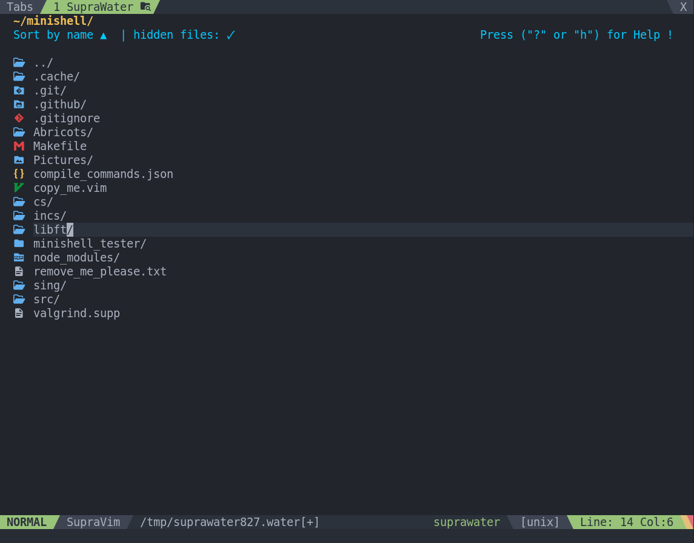
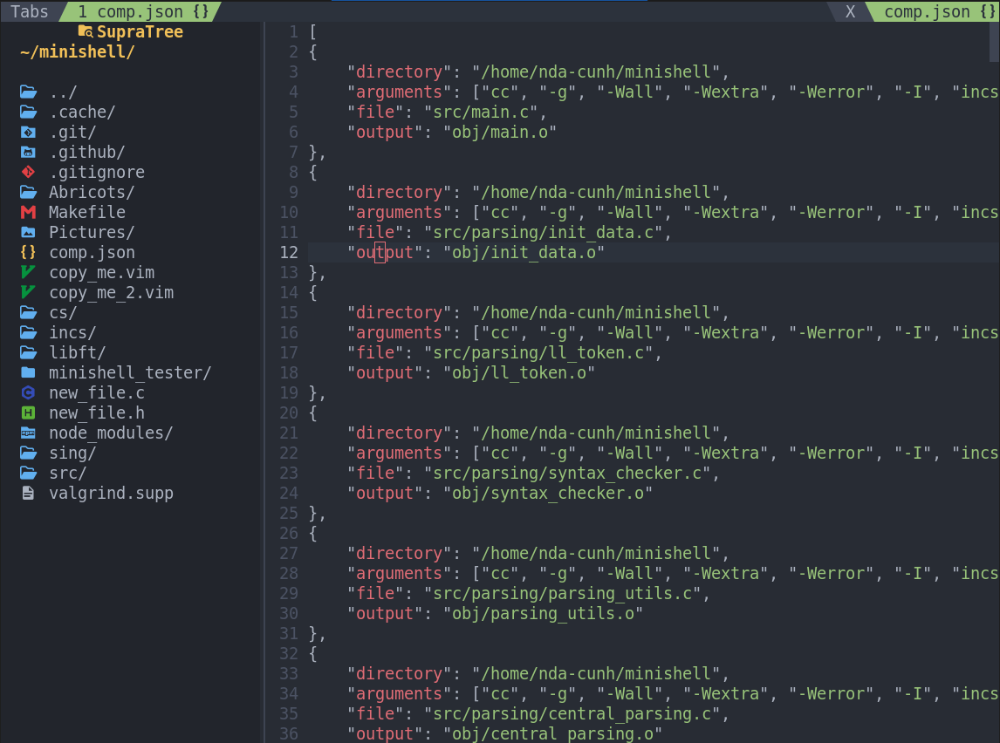
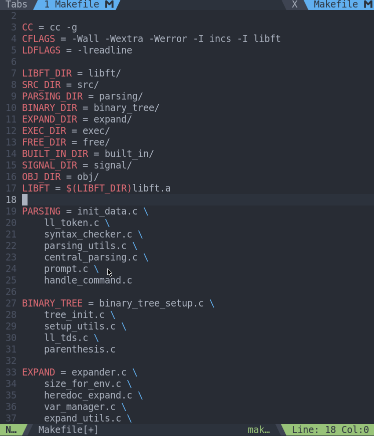
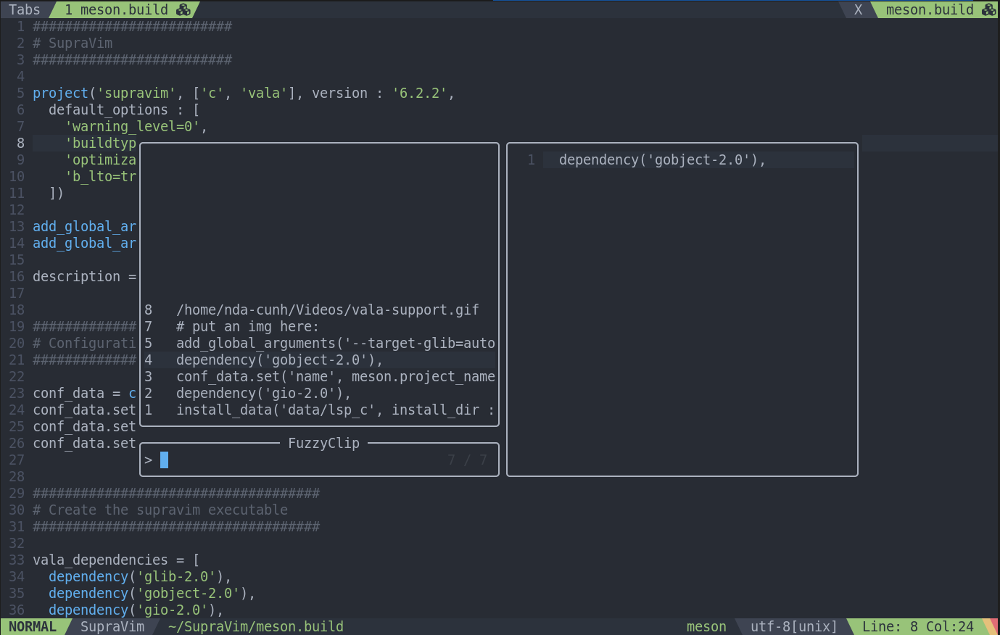

# 📜 CHANGELOG — Supravim 6.0

## 🚀 Nouveautés majeures
- **Support multi-langages étendu**  
  Prise en charge complète de nombreux langages supplémentaires, dont :
  - TypeScript
  - JavaScript
  - JSON
  - Java  
  … et bien d'autres.


- **SupraWater — Gestionnaire de fichiers intégré**  
  Nouveau gestionnaire graphique permettant de :
  - Créer, renommer, copier, coller et supprimer des fichiers.
  - Ouvrir les fichiers directement dans leur application appropriée (ex. : une image s’ouvre dans le visualiseur d’images, un exécutable s’exécute dans le terminal).



- **SupraTree — Vue en arborescence**  
  Version en arbre du SupraWater pour naviguer facilement dans la structure des fichiers.



- **SupraSearch — Recherche avancée graphique**  
  Interface complète pour rechercher et remplacer en temps réel, avec support des **expressions régulières**.



- **FuzzyClip — Gestionnaire d’historique du presse-papiers**  
  Accessible via `<space> c` pour retrouver facilement toutes les copies précédentes.




---

## 🎯 Modifications des raccourcis
- **Terminal** : `Shift+T` → `Ctrl+T`
- **AutoNorme** : `Ctrl+D` → `<space> v`
- **Activer AutoNorme** : `F2` → `<space> F2`
- **Désactiver la Norminette** : `F3` → `<space> F3`
- **Renommage LSP / rapide** : `F2`

---

## 🛠 Nouvelles options
- **Autoclose** (fermeture automatique des paires de caractères) :
  - `autoclose_quotes` : `"` `'` `` ` ``
  - `autoclose_brackets` : `(` `)` et `[` `]`
  - `autoclose_braces` : `{` `}`
  - `autoclose_angle` : `<` `>`

  Fonctionne également en **sélection visuelle** :  
  Exemple : sélectionner un texte puis taper `(` => le texte est automatiquement entouré par `(...)`.

- **symbol_signs** : Personnalisation des symboles d'erreurs dans la `signcolumn`.

- Activation/Désactivation via :

```bash
  supravim -e   # Activer
  supravim -d   # Désactiver
```

## 🎨 Améliorations

- Optimisation et intégration des thèmes pour un démarrage plus rapide et un rendu plus homogène.


