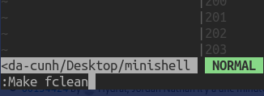
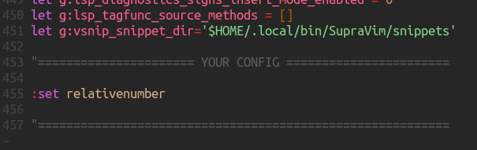

# SupraVim 4.7

Un éditeur de texte Vim pour 42 d'Angoulême.

MP moi sur le discord/slack de 42 si besoin (nda-cunh)


## Installation:

branche principal:
```bash
curl https://gitlab.com/hydrasho/SupraVim/-/raw/master/installer.sh | sh
```

branche dev:
```bash
curl https://gitlab.com/hydrasho/SupraVim/-/raw/dev/installer_dev.sh | sh
```

**Dépendances**

| Zsh | Clang | Vim 8 | Vala |
|-----|-------|-------|------|

## Mise à jour:
```bash
    supravim update
```

ou

```bash
    supravim update dev
```

## Désinstallation

```bash
    supravim uninstall
```
## Utilisation

| Nom | Raccourcis |
| ------ | ------ |
| Fermer une fenêtre | Ctrl + Q |
| Sauvegarde une fênetre | Ctrl + S|
| TOUT Sauvegarder | :wall|
| TOUT Quitter | :qall|
| HEADER 42| **F1**|
| Switch SupraNorm | **F3**|
| Compilation | **F5**|
| Debogueur (GDB) | **Ctrl + F5**|
| Deplacement entre fênetre | Shift - flèche|
| Fermer/Ouvrir l'arbre des répértoires | Ctrl +G |
| Scinder la fenêtre horizontalement | Ctrl + D|
| Scinder la fenêtre verticalement | Shift + D|
| Créer un nouvel onglet | Ctrl + N|
| Déplacement entre les onglets | Ctrl + Flèche|
| Ouvrir un terminal | Shift - T|
| Ctrl+R | le contraire du Undo.. le Redo|
| ------ | ------ |
| Ctr+ Up | Aller sur la fonction sous le curseur|
| Ctr+ Down |Retourner sur la fonction d'avant|

# Compilation



la commande ``:Make`` permet d'executer une règle de votre makefile (il se chargera de retrouvé le makefile lié  à votre projet.)
``:Make clean`` lancera la regle clean et ainsi de suite...

Si votre projet contient un fichier Makefile, vous pourrez compiler votre programme avec la touche F5, celui-ci le détectera et exécutera la règle RUN. (mettez all en dependance pour que run compile votre projet avant).

Dans le cas contraire, il compilera tous les fichiers C présents ensemble et exécutera le a.out généré.

note: F6 et F7 lance eux la règle run2 et run3 du makefile si elles existent.

# SupraMake

supramake est une commande de supravim (c'est celui-ci qu'il utilise pour le F5,6,7)
il fonctionne comme la commande make, sauf qu'il cherchera ou se trouve le makefile pour executer votre règle.

si vous êtes ici:
``~/Desktop/Projets/src/folder1/folder2/``
et que votre Makefile est ici:
``~/Desktop/Projets/Makefile``

``supramake rule`` le lancera, tandis que ``make rule`` ne le trouvera pas.
# Entrer dans une fonction

vous pouvez aller directement a une fonction ou define en question en faisant la touche 'Ctrl + UP' sur le symbole, il vous ouvrira le fichier et l'emplacement de l'initiation de ce symbole.
Ctrl+Down retournera en arrière.

Fonctionne avec les structures, defines et fonction.

# Débogage

Le débogage s'effectue avec CTRL-F5.
N'oubliez pas de compiler avec les flags `-g` ou `-g3` pour obtenir des informations plus approfondies.

Si votre programme est lancé via un makefile, Vim ne trouvera pas votre exécutable, il faudra le fournir à gdb avec `file monexe`.


Vous pouvez également quitter le mode avec Ctrl+Q tout comme le terminal.

# HEADER

Supravim vous permet aussi d'inclure les prototypes de vos fichiers C dans votre fichier header en utilisant la commande `:MakeHeader`.
Exemple: `:MakeHeader hello.c foo.c bar.c` écrira les prototypes de ces fichiers en dessous de votre curseur vim.
Note: Vous pouvez utiliser l'opérateur `*` ->  `*.c` | `xxx*.c`.


# Programme Supravim
Le programme Supravim s'utilise dans le terminal avec la commande `supravim`.
Il permet d'activer des options, de les désactiver, de changer son thème, de le mettre à jour ou de le désinstaller.
Vous pouvez également utiliser `supravim switch` pour passer d'une session Supravim à Vim et inversement.

`supravim --theme onedark` pour passer au theme onedark  (gruvbox) est par default.

Listes des themes:
``atom, gruvbox, molokai, onehalf, pablo, Tomorrow-Night-Eighties, dracula, iceberg, onedark, onelight, Tomorrow-Night``~~~~


n'hésitez pas à regarder ``supravim --status`` pour voir les options activé ou désactivé par default.

vous pourrez les activé avec ``supravime --enable option``
exemple:  ``supravim --enable icons``
activera la prise en charge d'icone.

exemple:  ``supravim --disable tree``
retirera l'arbre de dossier à gauche par défault.


# Tu veux le customisé un peu plus ?




Tu peux ajouter tes propres lignes de vim dans cette balise, à chaque mise à jour la balise sera conservé et jamais écrasé.

# Vous faites une autre langue que C, C++, Vala ?

il suffit de faire ``:LspInstallServer VotreServer``

la listes des serveur est ici https://github.com/mattn/vim-lsp-settings#supported-languages


je recommande egalement d'ajouter dans votre balise YourConfig:
```
if expand('%:e') == '.py'                     
    let lsp_diagnostics_enabled=1
    let g:lsp_diagnostics_signs_enabled = 1
endif                                         
```
remplacer .py par l'extension de votre fichier

# Autre chose ? une idée ?
ouvrez un ticket ! ou mp moi sur discord (nda-cunh) ou demandez le moi directement
je suis à l'écoute d'un peu tout :)


# CHANGELOG
# Nouveautés de la 2.0

- Support des onglets.
- Ajout de l'intégration GDB.
- UNDO infini! (se sauvegarde même après la fermeture).
- Générateur de prototype pour les headers C.
- Commenter et décommenter en selectionnant une ou plusieurs lignes.
- Création d'un mini logiciel Supravim (`supravim -h` pour plus de détails).
    * Personnaliser le thème de Vim et les options.
    * Désinstaller ou mettre à jour Supravim.

# Nouveautés de la 3.0

- Beaucoup de corrections de bugs !
- GDB (CTRL+F5) compile avant de se lancer.
- Un installateur plus propre.
- Les configurations sont enregistrées après les mises à jour.
- Un espace dédié dans le vimrc qui ne sera pas effacé lors des mises à jour.
- Une intégration aux CTAGS.
- Pouvoir quitter les terminaux ou le GDB avec CTRL+Q ou s'en deplacer.
- SNIPPETS intelligents et complets.
- F3-F5 efface désormais l'écran pour ne pas saccader l'affichage.
- De nouvelles options et une autocomplétion dans le programme.
- De nouveaux thèmes (onedark|half|light / atom / iceberg).
- Une meilleure integration de thèmes et  Nouveautés de la 3.0

# Nouveautés de la 4.0

- Nouveau moteur de complétion sur clang
- Ctags intelligent
- SupraNorme (norme en temps réel)
- Nouveau moteur de Snippet (désormais peuvent être changé mannuellement avec :VsnipOpen)
- refonte de l'autocompilation F5
- suppression du bug avec les fichier temporaire dans le TMP
- rearrangement de l'installeur
- utilisation des extensions de fichier plutôt que leurs filetype
- et evidément plein de bugs corrigé.
4.4:
- F3 = active/desactive supraNorm
- Ajout de snippet pour Makefile