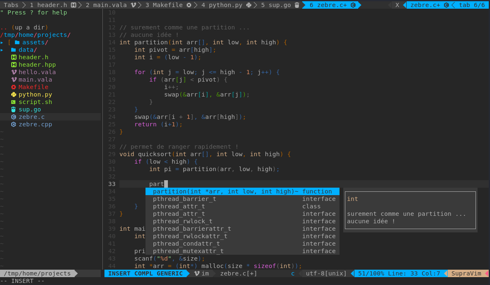
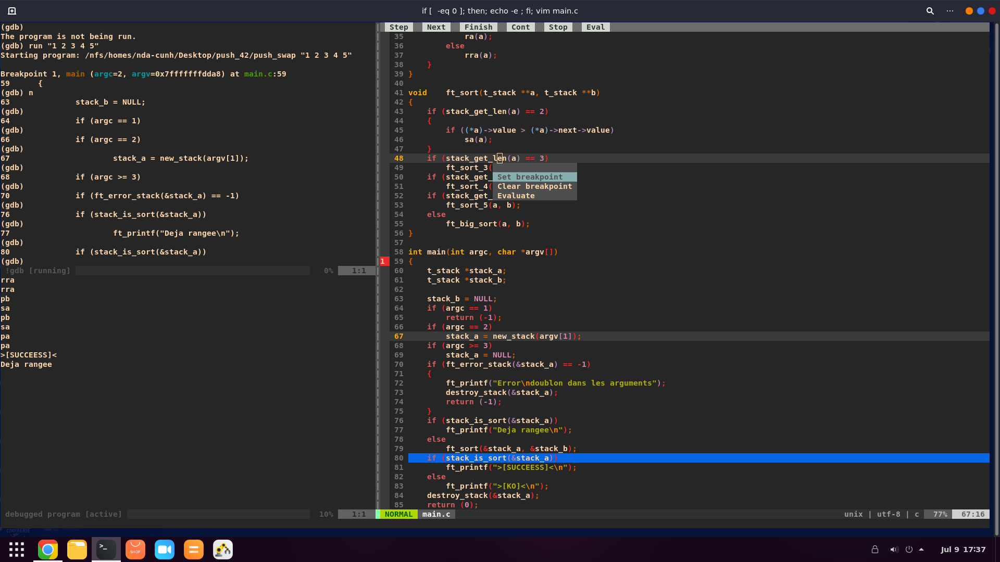
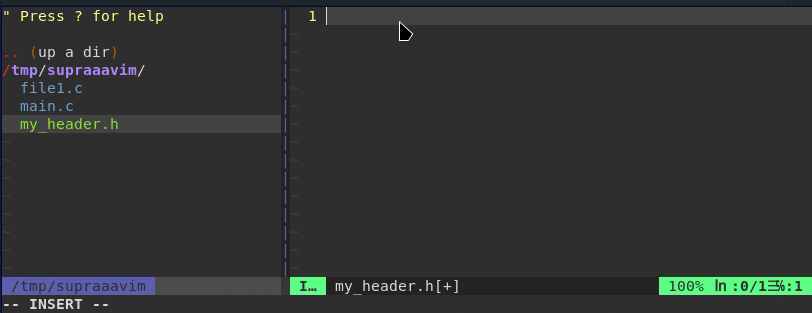
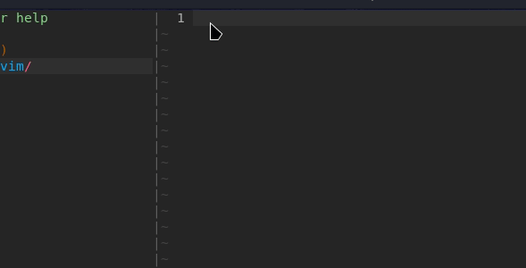
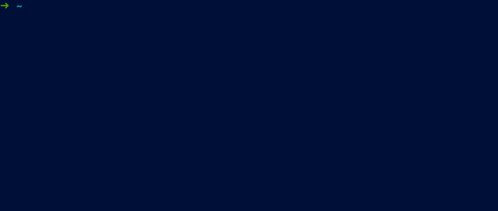

# SupraVim

L'editeur de texte vim pour 42 Angoulême.



## Installation:

```bash
curl https://gitlab.com/hydrasho/SupraVim/-/raw/master/installer.sh | sh
```
**Dépendance**

| Zsh | Clang | Vim 8 |
|-----|-------|-------|

## Mise à jour:
```bash
    supravim update
```


## Désinstallation

```bash
    supravim uninstall
```
## Utilisation

| Nom | Raccourcis |
| ------ | ------ |
| Quitter | Ctrl + Q |
| Sauvegarde | Ctrl + S ou Ctrl + W |
| HEADER 42| **F1**|
| Norminette | **F3**|
| Compilation | **F5**|
| Debogueur | **Ctrl + F5**|
| Deplacement | Shift - flèche|
| Fermer/Ouvrir la fenêtre des dossiers | Ctrl +G |
| scinder la fenetre horizontalement | Ctrl + D|
| scinder la fenetre verticalement | Shift + D|
| Crée un nouvelle onglet | Ctrl + N|
| Déplacement entre onglet | Ctrl + Flèche|
| Ouvre un Terminal | Shift - S|

# Compilation

Vous pouvez compiler votre programme avec la touche F5
si votre projet contient un Makefile, celui-ci le detectera et executera la regle
ALL,  suivie de la regle RUN.

sinon si il ne contient pas de Makefile,
il compilera tout les fichier C present ensemble et executera le a.out généré.

# Debbug

Le debug s'effectue avec CTRL-F5.
Pour l'utiliser, n'oubliez pas de compiler avec les flags `-g` ou `-g3 -Og` pour obtenir des informations
de debug plus exacte et complete.

Si votre programme est lancé via un makefile, vim ne trouvera pas votre executable, il faudra le fournir a gdb
avec `file monexe`



# HEADER

supravim vous permez aussi d'inclures vos prototype de vos fichier C dans votre header en utilisant la commandes `:MakeHeader`
exemple:  `:MakeHeader hello.c foo.c bar.c` écrira les prototypes de ces fichiers sous votre curseur vim.
Notes: vous pouvez utiliser l'operateur `*` ->  `*.c` | `xxx*.c`



# SNIPPET

les snippets permet d'écrirent du code pré-écris pour augmenter sa vitesse de code les snippets existant sont:
| SNIPPET | Fonction |
| ------ | ------ |
| ifndef| IFNDEF de 42|
| mainv| un main void|
| main | un main vide avec argc,argv|
| mainh|  un main avec tout les headers pour debugué rapidement|
| while| boucle while |
| if| condition if |
| elif | condition else if() |
| inc ou include| #include <name.h>|
| func| debut l'écriture dune fonciton |
| funcd| parreil mais uniquement pour un prototype |
| for| boucle for |
| tstruct ou struct| une structure avec typedef ou simple |



# Programme supravim
le programme supravim s'utilise dans le terminal avec la commande supravim
celui-ci permet d'activer des options ou de les desactivée. de changer son theme ou bien de le mettre à jour ou le désinstaller.
vous pouves aussi ``supravim switch`` pour passer d'une session supravim a vim simple ou la remettre.



# CHANGLOG
# Nouveauté de la 2.0

- supports des onglets
- Ajout de l'intégration GDB
- UNDO infini! (se sauvegarde même après la fermeture)
- Generateur de prototype pour les headers C
- Commenter , Decommenter en selectionnant une ou plusieurs lignes
- Creation d'un mini logiciel supravim (`supravim -h` pour plus de details)
    * Customiser le theme de vim et les options
    * Desinstaller ou mettre à jour supravim

# Nouveauté de la 3.0

- beaucoup de correction de bug !
- GDB (CTRL+F5) compile avant de se lancer
- un installeur plus propre
- les config sont garder avec le supdates
- un espace dédié dans le vimrc qui ne sera pas effacer lors des maj
- une integrations aux CTAGS
- pouvoir quitter les terminaux ou le GDB avec CTRL+Q ou s'en deplacé
- SNIPPETS intelligent et complet.
- F3-F5 efface désormais l'écran pour ne pas saccader l'affichage
- de nouvelles options et une autocompletion sur le programme.
- de nouveaux themes (onedark|half|light / atom / iceberg)
- une meilleurs integrations de themes et des icons activable.
