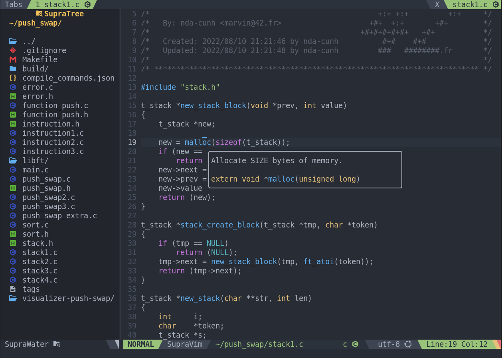
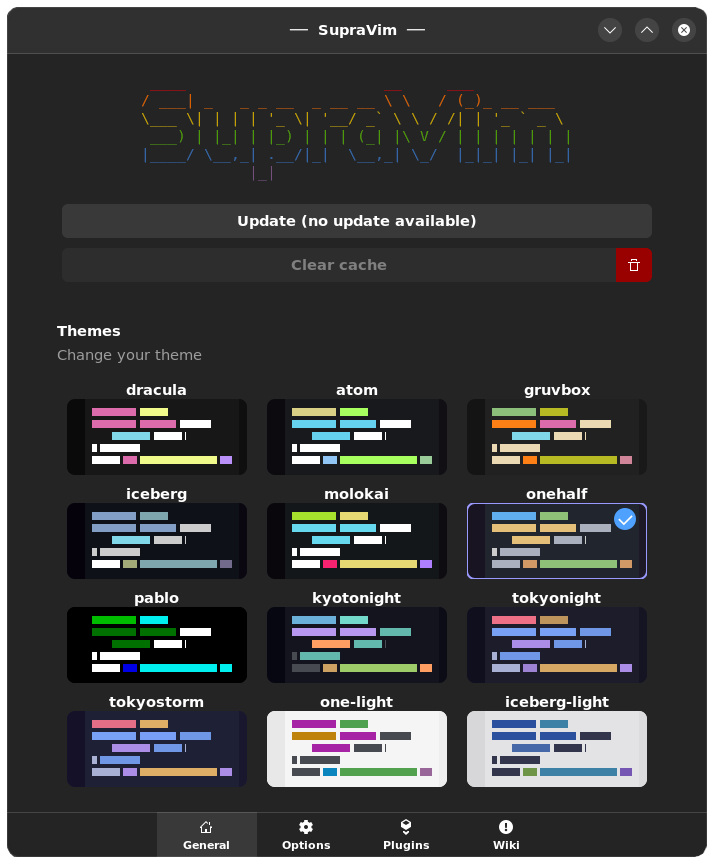

# SupraVim 6.6

**A simple yet powerful Vim distribution** — easy to use, packed with features, and built with **Vim9** and **Vala**.

SupraVim is **highly customizable**, offering pre-designed modules and configuration options. It supports many programming languages and tools out of the box, with even more available through the **Suprapack** module system.

---

## ✨ Features

- **Modern Vim9 experience** with clean, modular scripting
- **Highly customizable** — easily tweak settings to match your workflow
- **Integrated file browser** for quick project navigation
- **Easy LSP detection & installation** for maximum language support
- **Built-in compilation interface** supporting:
  - `make`
  - `cmake`
  - `ninja`
  - `meson.build`
- **VSCode-like shortcuts** for a smoother transition for new users
- **Mouse support** for easier navigation (ideal for beginners)
- **Multi-language support**:
  - C
  - C++
  - Vala
  - Assembly (NASM)
  - Python
  - Rust
  - …and more via **Suprapack**

📚 **Documentation & Help**: [Visit the SupraWiki](https://gitlab.com/nda-cunh/SupraVim/-/wikis/home)

---

## 📦 Installation

### Dependencies
- **Vim** 9.0+
- **Suprapack**
- **glib-networking**
- (Optional but recommended) [Nerd Font](https://www.nerdfonts.com/) — install manually or via Suprapack:
  ```bash
  suprapack search -ttf
  ```

---

### Install with `curl`
```bash
curl https://gitlab.com/nda-cunh/SupraVim/-/raw/master/install.sh | bash
```

### Install with `suprapack`

🐧 **Linux**:
```bash
suprapack install supravim
```

🍎 **macOS**:
Read the macOS instructions here: [MacOS Support Guide](https://gitlab.com/nda-cunh/SupraVim/-/wikis/Mac-Os)  
Then compile and install:
```bash
curl https://gitlab.com/nda-cunh/SupraVim/-/raw/master/create_package.sh | bash
```

---

## 🔄 Update & Uninstall

**Update SupraVim**:
```bash
supravim --update
```

**Uninstall SupraVim**:
```bash
supravim --uninstall
```

---

## 📷 Screenshots
  


---

## 💬 Feedback & Ideas
Got suggestions or ideas?
- Open an issue on GitLab
- Message me on Discord: **nda-cunh**
- Reach out on 42’s Discord/Slack

I’m open to all kinds of feedback!

---

## 🛠 Development

To build SupraVim yourself, you’ll need **Suprapack**:

```bash
git clone https://gitlab.com/nda-cunh/SupraVim
cd SupraVim
# Make changes
meson build --prefix=$PWD/usr
ninja install -C build
# Install the new build
suprapack add supravim-*.suprapack
```

To build SupraVim and all modules:
```bash
curl https://gitlab.com/nda-cunh/SupraVim/-/raw/master/create_package.sh | bash
```
