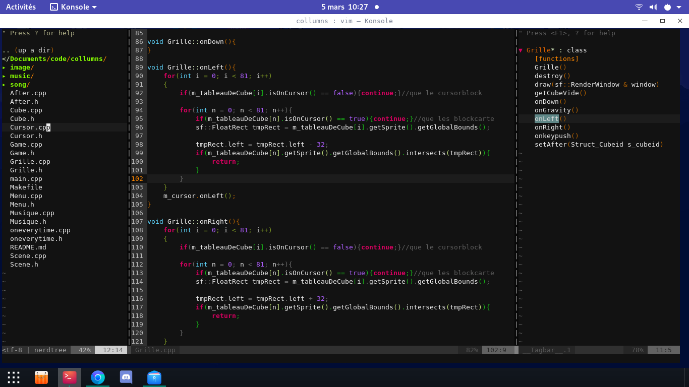

**SupraVim**

une amelioration de l'editeur de texte vim.




**dépendance**

- ZSH
- clang
- ctags
- zsh
- vim 8 or  +

**Installation**

```bash
curl https://raw.githubusercontent.com/hydrasho/SupraVim/master/installer.sh | sh
```
note: je n'ai pas tester sous MAC (mais devrait fonctionné)


il implemente:
- le CTRL+E pour compiler et executer directement les fichier C
- une autocompletion avec parametre des fonctions (selon les includes)
- la fenetre de Ctags a droite qui peut etre fermee avec <F8>
- gestionnaire de fichier NEARDTREE a gauche Shift arrow pour se deplacer
- <Ctrl + S> et <Ctrl + Q> pour sauvegarder et fermer rapidement.
- <ctrl+k> pour make run
- coloration syntaxique du vala, C++, C, python
- Et divers plugins !


