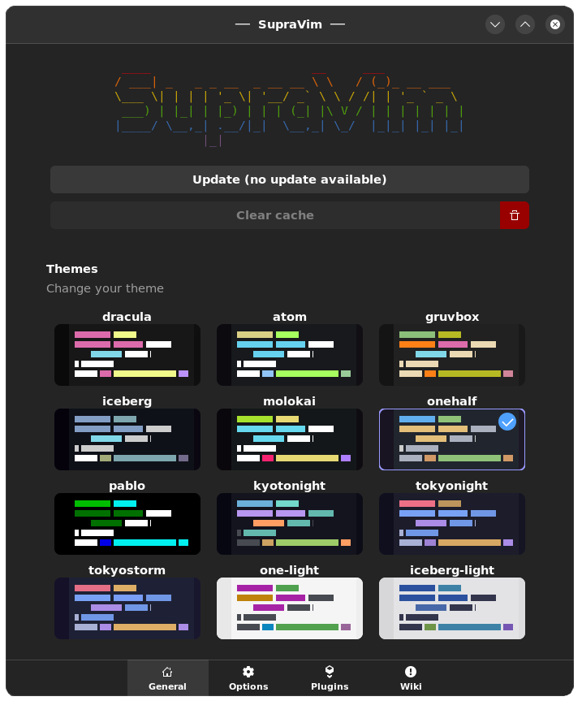

# SupraVim 5.88

SupraVim is a vim distribution for 42 students (and other), it's a simple and easy to use vim distribution with a lot of features. it is based on vim9 and vala.
it's highly customizable with pre-designed modules and options.
Supravim support a lot of languages and tools, it's a good choice for a beginner and a pro.
- C
- C++
- vala
- Asm (nasm)
- python
- rust
And more... with suprapack module !

# [The SupraWiki (help and documentation) Click here](https://gitlab.com/nda-cunh/SupraVim/-/wikis/home)


# How Install 
### Dependencies

Supravim: (vim9, zsh)
Suprapack (glib-networking) 

## with curl
```bash
curl https://gitlab.com/nda-cunh/SupraVim/-/raw/master/install.sh | bash
```

## with suprapack

### 🐧 Linux:
```bash
suprapack install supravim
```
### 🍎 MacOs
For MacOs support please read this: https://gitlab.com/nda-cunh/SupraVim/-/wikis/Mac-Os

just run for compiling all the modules and install supravim:

```bash
curl https://gitlab.com/nda-cunh/SupraVim/-/raw/master/create_package.sh | bash
```

# Update & Uninstall

#### Update:
```bash
supravim --update
```

#### Uninstall

```bash
supravim --uninstall
```




# Autre chose ? une idée ?
ouvrez un ticket ! ou mp moi sur discord (nda-cunh) ou demandez le moi directement
je suis à l'écoute d'un peu tout :)

MP moi sur le discord/slack de 42 si besoin (nda-cunh)

# Developper

## How build ?

you need suprapack to build it
```bash
git clone https://gitlab.com/nda-cunh/SupraVim
cd SupraVim
# Modifiy
suprapack build usr
# Install the new version with it
suprapack add supravim-*.suprapack
```

for build all the supravim and modules
```bash
curl https://gitlab.com/nda-cunh/SupraVim/-/raw/master/create_package.sh | bash
```
