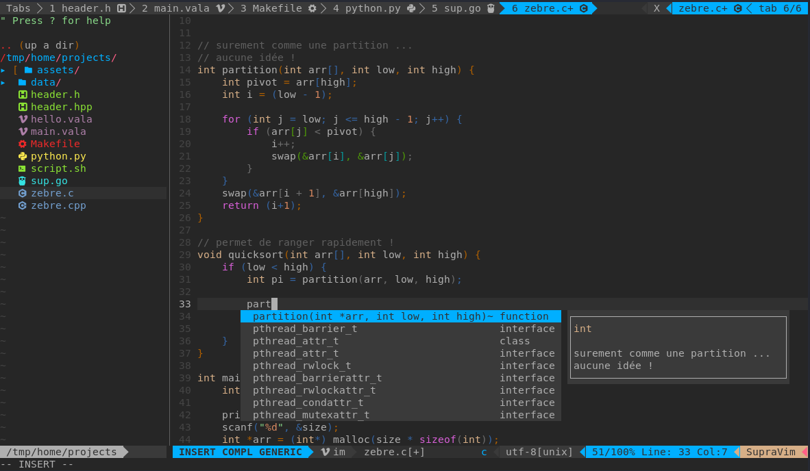

# SupraVim 4.5.1

# [Le SupraWiki (Documentation et Aide)](https://gitlab.com/hydrasho/SupraVim/-/wikis/home)
La documentation de Supravim est ici : 
[>> Clique sur moi <<](https://gitlab.com/hydrasho/SupraVim/-/wikis/home)


### Dépendances
| Zsh | Clang | Vim 9 | Vala |
|-----|-------|-------|------|
## Installation:
```bash
curl https://gitlab.com/hydrasho/SupraVim/-/raw/master/installer.sh | sh
```

#### Mise à jour:
```bash
    supravim update
```

#### Désinstallation

```bash
    supravim uninstall
```
# note


N'hésitez pas à découvrir d'autre éditeur de texte, ou d'ide ou de construire votre propre configuration VIM la seule limite et votre pensée. savoir configurer ses outils , c'est aussi être plus à l'aise avec votre travail.



# Autre chose ? une idée ?
ouvrez un ticket ! ou mp moi sur discord (nda-cunh) ou demandez le moi directement
je suis à l'écoute d'un peu tout :)

MP moi sur le discord/slack de 42 si besoin (nda-cunh)
