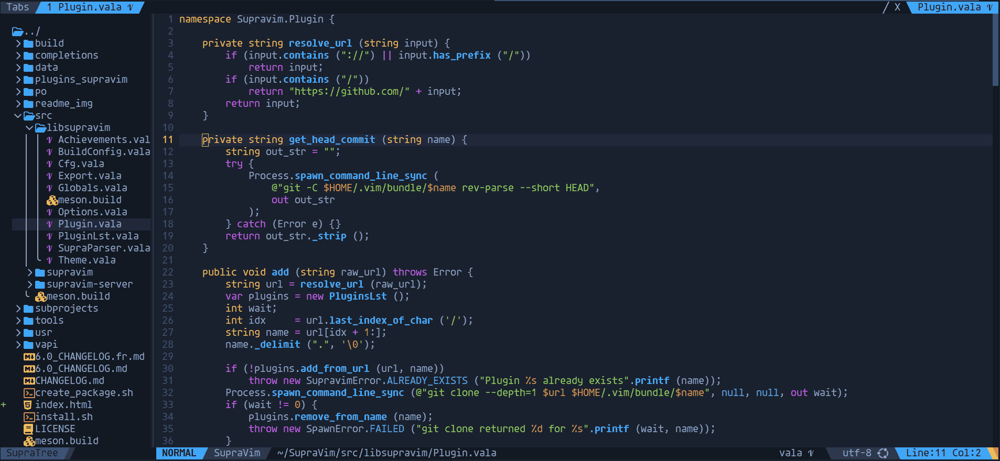

<div align="center">
<a href="https://supravim.dev/">
    
</a>

  **Vim, fully equipped.**

  200+ plugins, coding stats and 35 languages, ready on first launch.
  A Vim distribution written in Vim9script and Vala
  for Vim 9, not Neovim.

  [**supravim.dev**](https://supravim.dev) · [SupraWiki](https://gitlab.com/nda-cunh/SupraVim/-/wikis/home) · [Changelog](CHANGELOG.md)
</div>

<br>



---

## Install

```bash
curl https://supravim.dev/install | sh
```

Or through the package manager:

```bash
suprapack install supravim
```

**Requirements**: Vim 9.1.1010, [Suprapack](https://gitlab.com/nda-cunh/suprapack), glib-networking.
A [Nerd Font](https://www.nerdfonts.com/) is optional but makes the icons render — `suprapack search -ttf`.

**macOS**: read the [macOS guide](https://gitlab.com/nda-cunh/SupraVim/-/wikis/Mac-Os) first, then:

```bash
curl https://supravim.dev/macos | sh
```

### Update and remove

```bash
suprapack update supravim
suprapack remove supravim
```

---

## What you get

- **Plugin store** — 200+ plugins, browsable by category, installed in one click from the settings app
- **36 language servers** pre-configured, with syntax and indentation to match; add your own from the GUI
- **Coding stats** — a year-long activity heatmap, time per language and per project, streaks and totals, all tracked locally
- **68 achievements**, with an API third-party plugins can push metrics to
- **20+ themes** — supradeep by default, plus catppuccin, gruvbox, rose-pine, dracula, iceberg and friends
- **Async builds** — make, cmake, ninja and meson run in a popup and feed the quickfix list
- **VSCode-style shortcuts** and mouse support, so you can switch over gradually
- Export and import your whole configuration as a single archive

---

## Development

```bash
git clone https://gitlab.com/nda-cunh/SupraVim
cd SupraVim
meson setup build --prefix=$PWD/usr
ninja install -C build
suprapack add supravim-*.suprapack
```

Requires meson 1.11.0 or later.

To build SupraVim and every module at once:

```bash
curl https://supravim.dev/macos | sh
```

---

## Feedback

Ideas and complaints are both welcome.

- Open an [issue](https://gitlab.com/nda-cunh/SupraVim/-/issues)
- Discord: **nda-cunh**

## License

[GPL-3.0](LICENSE)
