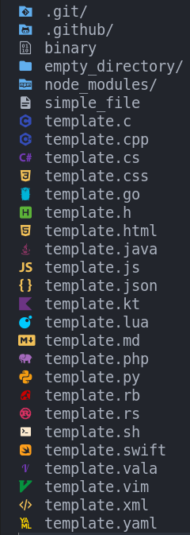

# SupraIcons: Fast and Comprehensive File Icons for Vim


SupraIcons is a fork of the popular `vim-devicons` plugin, rewritten from the ground up to be more performant and to include a significantly larger number of icons. While the original project was excellent, it lacked icons and its speed was not optimal. **SupraIcons solves these issues**, offering a fast and visually rich solution for all your file and directory icon needs in Vim.



---

## ✨ Key Features

* **Optimized Performance**: A complete rewrite of the code for ultra-fast icon detection.
* **More Icons**: An expanded icon library for better coverage of file and directory types.
* **Easy Integration**: Integrates effortlessly with your existing Vim configuration.

---

## 🚀 Usage

SupraIcons provides a simple function you can call to get the icon corresponding to a file or directory.

### Getting an Icon with `g:WebDevIconsGetFileTypeSymbol`

The `g:WebDevIconsGetFileTypeSymbol` function is the core of SupraIcons. It takes two arguments:

* `value`: (string) The name of the file or directory (including the path).
* `type_id`: (number, optional) The element type. The default value is **-1**.
    * **-1**: Autodetect. The plugin tries to determine if `value` is a file, a binary, or a directory.
    * **0**: File.
    * **1 and up**: Directory.

https://github.com/Donaldttt/fuzzyy can use it directly

for integrate it just check if g:webdevicons_enable is set
and you can call the function directly

You can get the Distro icon with **g:WebDevIconsGetFileFormatSymbol()**

#### Usage Example

```vim
" For a file
let file_icon = g:WebDevIconsGetFileTypeSymbol("README.md", 0)

" For a directory
let dir_icon = g:WebDevIconsGetFileTypeSymbol("my-project-folder", 1)

" Autodetect (recommended)
let auto_icon = g:WebDevIconsGetFileTypeSymbol("src/main.js")
```

This function returns a string containing the appropriate icon. You can use it in your status line, in a file explorer, or anywhere you wish to display an icon.
