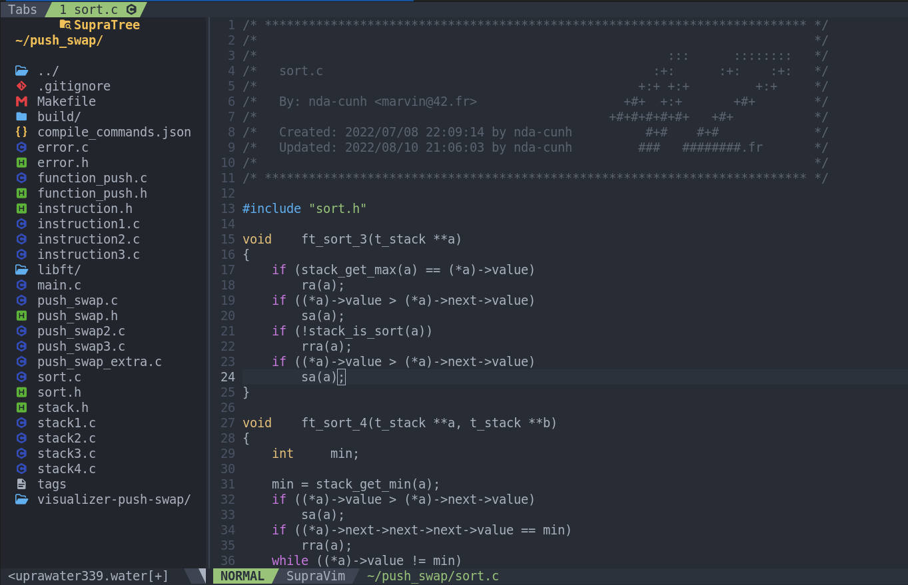
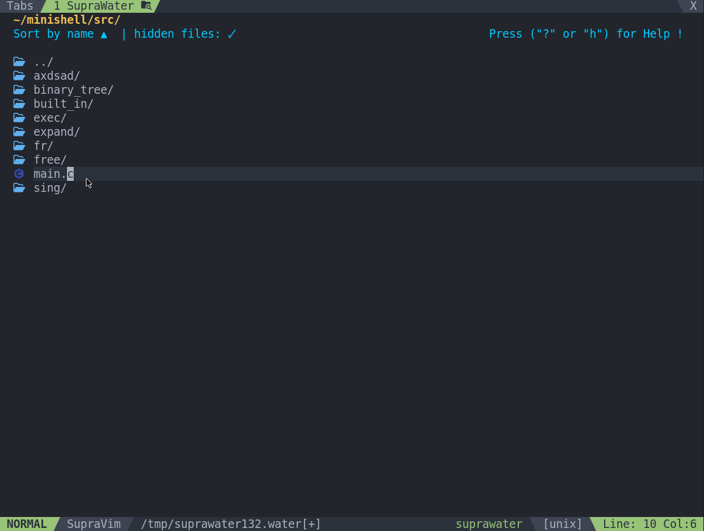

# SupraTree: A Powerful File Manager for Vim9.0+

SupraTree is a modern and high-performance Vim9Script plugin designed exclusively for **Vim9.0 and later**. Inspired by tools like Neovim's `vim-oil` and `nerdtree`, it provides a comprehensive and editable file explorer directly within your Vim environment.

---

## ✨ Key Features

* **Powerful File Explorer**: Easily navigate, open, and manage your file tree.
* **Seamless Integration**: Built specifically for the Vim9 engine, ensuring speed and stability.
* **Editable Tree**: Rename files and folders directly from the explorer view.
* **Customizable**: Easily configure the display and key bindings to suit your workflow.

---

## 🚀 Installation

To install SupraTree, you can use a Vim9 plugin manager like `vim-plug` or `dein.vim`, or a simple file-based manager like `supraload` or `pathogen`.

### Using `vim-plug`

Add the following line to your `.vimrc` or `init.vim` file:

`vim
Plug 'your_github_username/supraTree'
`

Then, restart Vim and run `:PlugInstall`.

### Using `supraload` (or `pathogen`)

1.  Navigate to your Vim plugins directory. For `supraload`, this would be `~/.vim/bundle/` (or similar, depending on your setup).
2.  Clone the repository directly into this directory:

`bash
cd ~/.vim/bundle/
git clone https://github.com/your_github_username/supraTree.git
`

This method automatically loads the plugin when Vim starts, similar to how `pathogen` works.

---
## 📚 Dependencies
install this too https://github.com/nda-cunh/SupraPopup

## 🛠️ Configuration

You can customize SupraTree's behavior by setting these options in your Vim configuration file.

### Available Options

* `g:SupraTreeIgnoreTree`: A list of patterns (regex) to ignore specific files or folders in the tree.
    * **Example**: `let g:SupraTreeIgnoreTree = ['\.png$', '\.jpg$', '\.o$']`

* `g:SupraTreeWinSize`: The width of the explorer window in columns.
    * **Example**: `let g:SupraTreeWinSize = 27`

---

## ⌨️ Commands and Key Bindings

SupraTree provides several commands to interact with the file explorer. You can map these to your preferred key bindings.

### Commands

* `:SupraTreeToggle`: Toggles the file tree window (opens if closed, closes if open).
* `:SupraTreeOpen`: Opens the file explorer.
* `:SupraTreeClose`: Closes the file explorer.

### Key Bindings (within the tree window)

* `<C-q>`: Quit the explorer.
* `<BackSpace>` / `-`: Go back to the parent directory.
* `<Enter>` / `<Click>`: Enter the folder or open the selected file.
* `<C-h>`: Open the file/folder in a horizontal split.
* `<C-v>`: Open the file/folder in a vertical split.
* `<C-t>`: Open the file/folder in a new tab.
* `<C-p>`: Preview the file.
* `~`: Go to the home directory.
* `_`: Enter the folder and jump to the last position.
